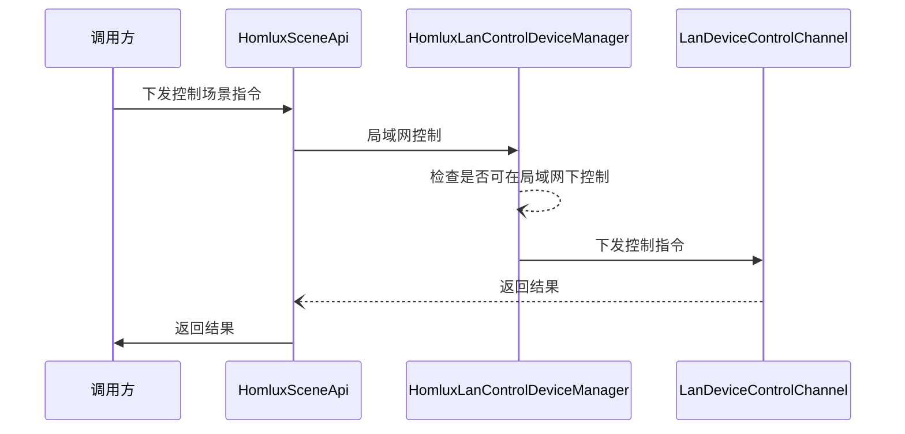
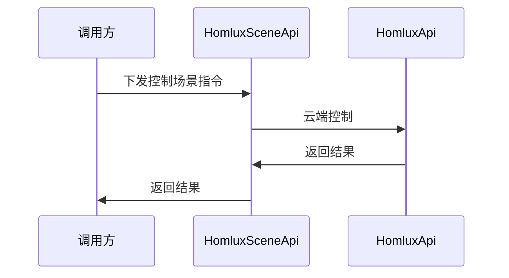
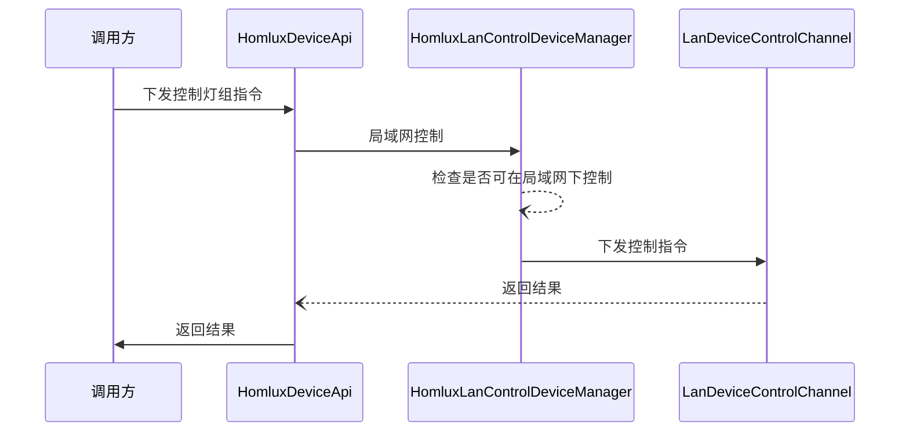
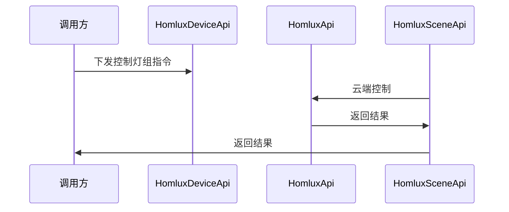
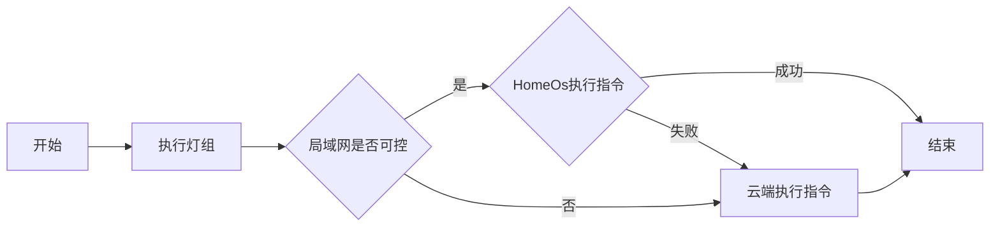
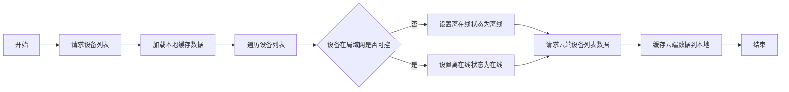
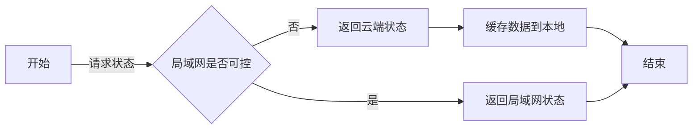
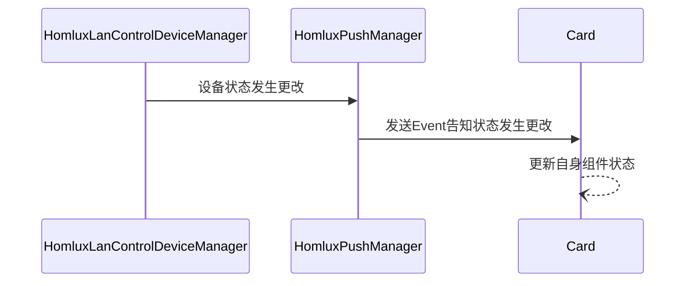
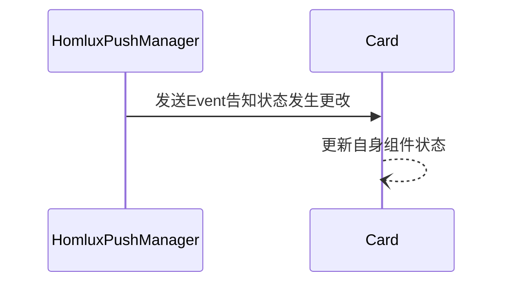

# 需求背景
`场景`、`灯组`、`设备`在网络控制的基础上，再增加局域网控制。

# 功能清单

- 场景：
    1. 提供局域网场景列表
    2. 执行局域网场景

- 灯组：
    1. 提供局域网灯组列表
    2. 执行局域网灯组（开关、色温、亮度）
    3. 暂不提供灯组状态（开关、色温、亮度）

- 设备：
    1. 提供局域网设备列表
    2. 执行局域网设备（开关等各种功能）
    3. 提供查询单个设备状态

- 支持本地局域网下正常使用：
    1. 缓存云端数据
    2. 涉及缓存状态数据的修改

# 核心逻辑时序图
> 场景

- 局域网控制-时序图

- 云端控制-时序图

- 混合控制-逻辑图

> 灯组

- 局域网控制-时序图

- 云端控制-时序图

- 混合控制-逻辑图

> 设备

- 查询设备列表-逻辑图

- 查询单个设备状态-逻辑图

- 混合控制-逻辑图

- 局域网设备状态推送-时序图

- 云端设备装填推送-时序图

# 扩展与维护

