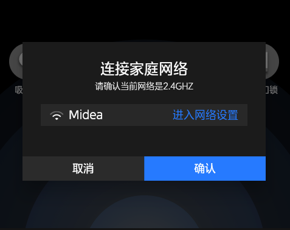

# 对话框

### 简介
基于 `AlertDialog` 封装  



### widget结构
AlertDialog|
-|
title|
desc|
contentSlot|
btnList|

### 基本用法

```dart
import 'package:screen_app/widgets/index.dart';

MzDialog mzDialog = MzDialog(
    title: '标题',
    desc: '紧接标题的描述',
    btns: ['取消', '确认'],
    contentSlot: selectWifi(),
    contentPadding: const EdgeInsets.fromLTRB(30, 20, 30, 50),
    onPressed: (String item, int index) {
        logger.i('$index: $item');
    });

bool? result = await mzDialog.show(context); // 对话框关闭后的返回值（最后一个按钮返回 `true`，其余 `false`）
```

### 参数配置
| Prop | Type | Required | Default | Description |
|------|------|----------|---------|-------------|
| title | `String` |`No`| - | 标题，超出长度则截断并显示...|
| titleSize | `double` |`No`| `24.0` | 标题字号 |
| desc | `String` |`No`| - | 描述，超出长度则截断并显示...|
| backgroundColor | `Color` |`No`| `Color(0xff1b1b1b)` | 背景颜色 |
| titlePadding | `EdgeInsetsGeometry` |`No`| `EdgeInsets.only(top: 30)` | 标题边距 |
| contentPadding | `EdgeInsetsGeometry` |`No`| `EdgeInsets.all(20)` | 内容边距 |
| shape | `ShapeBorder` |`No`| `RoundedRectangleBorder(borderRadius: BorderRadius.zero)` | 边框样式定义（默认无圆角） |
| btns | `List<String>` |`No`| `RoundedRectangleBorder(borderRadius: BorderRadius.zero)` | 底部操作按钮列表（最后一个按钮使用选中样式） |
| contentSlot | `Widget` |`No`| - | 内容区域插槽 |


### 事件
| EventName | Parameters | Required |  Description |
|------|------|----------|--------------|
| onPressed | `String, int` | `No` | 底部操作按钮被点击时触发 |
