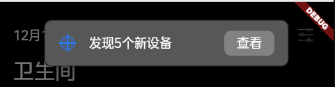

# 通知框

### 简介
基于 `Dialog` 封装，上部居中的简化版对话框



### widget结构
```markdown
┏━━━━━━━━━━━━━━━━━━━━━━━━━━━━━━━━━━━━━━━┓
┃                MzDialog               ┃
┡━━━━━━━━━━╇━━━━━━━╇━━━━━━━━━━━━━━━━━━━━┩
│ icon     │ title │ rightSlot, btnText │
└──────────┴───────┴────────────────────┘
```

### 基本用法

```dart
import 'package:screen_app/widgets/mz_notice.dart';

MzNotice mzNotice = MzNotice(
          title: '发现5个新设备',
          backgroundColor: const Color(0XFF575757),
          onPressed: () {});

await mzNotice.show(context);
```

### 参数配置
| Prop            | Type           | Required | Default                                                           | Description |
|-----------------|----------------|----------|-------------------------------------------------------------------|---------|
| title           | `String`       | `Yes`    | -                                                                 | 标题，超出长度则截断并显示...|
| backgroundColor | `Color`        | `No`     | `Color(0xff1b1b1b)`                                               | 背景颜色 |
| shape           | `ShapeBorder`  | `No`     | `RoundedRectangleBorder(borderRadius: BorderRadius.circular(10))` | 边框样式定义（默认无圆角） |
| btnText         | `String`       | `No`     | `查看`                                                            | 操作按钮文字 |
| icon            | `Widget`       | `No`     | -                                                                 | 左侧图标 |
| rightSlot       | `Widget`       | `No`     | `false`                                                           | 右侧按钮插槽 |


### 事件
| EventName | Parameters | Required |  Description |
|------|------------|----------|--------------|
| onPressed | -          | `No` | 右侧按钮点击事件 |
